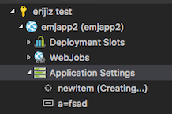

# VSCode Azure SDK for Node.js - UI Tools (Preview)

This package provides common Azure UI elements for VS Code extensions.

> NOTE: This package throws a `UserCancelledError` if the user cancels an operation. This error should be handled appropriately by your extension.

## Azure Tree Data Provider


### Display Azure Resources
Follow these steps to create your basic Azure Tree:
1. Implement an `IAzureTreeItem` (or `IAzureParentTreeItem`) describing the items to be displayed under your subscription:
    ```typescript
    export class WebAppTreeItem implements IAzureTreeItem {
        public static contextValue: string = 'azureWebApp';
        public readonly contextValue: string = WebAppTreeItem.contextValue;
        private readonly _site: Site;
        constructor(site: Site) {
            this._site = site;
        }

        public get id(): string {
            return this._site.id;
        }

        public get label(): string {
            return this._site.name;
        }
    }
    ```
1. Create a `resourceProvider` that provides the tree items you just implemented. It must implement at least `hasMoreChildren` and `loadMoreChildren`:
    ```typescript
    export class WebAppProvider implements IChildProvider {
        private _nextLink: string | undefined;

        public hasMoreChildren(): boolean {
            return this._nextLink !== undefined;
        }

        public async loadMoreChildren(node: IAzureNode): Promise<WebAppTreeItem[]> {
            const client: WebSiteManagementClient = new WebSiteManagementClient(node.credentials, node.subscription.subscriptionId)
            const webAppCollection: WebAppCollection = this._nextLink === undefined ?
                await client.webApps.list() :
                await client.webApps.listNext(this._nextLink);
            this._nextLink = webAppCollection.nextLink;
            return webAppCollection.map((site: Site) => new WebAppTreeItem(site)));
        }
    }
    ```
1. Instantiate a new instance of `AzureTreeDataProvider` in your extension's `activate()` method, passing the `resourceProvider` and `loadMoreCommandId`. The `loadMoreCommandId` maps the 'Load More...' node to the command registered by your extension.
    ```typescript
    const treeDataProvider = new AzureTreeDataProvider(new WebAppProvider(), 'appService.LoadMore');
    context.subscriptions.push(treeDataProvider);
    context.subscriptions.push(vscode.window.registerTreeDataProvider('azureAppService', treeDataProvider));
    ```

### Advanced Scenarios
The above steps will display your Azure Resources, but that's just the beginning. Let's say you implemented a `browse` function on your `WebAppTreeItem` that opened the Web App in the browser. In order to make that command work from the VS Code command palette, use the `showNodePicker` method:
```typescript
context.subscriptions.push(vscode.commands.registerCommand('appService.Browse', async (node: IAzureNode<WebAppTreeItem>) => {
    if (!node) {
        node = <IAzureNode<WebAppTreeItem>>await treeDataProvider.showNodePicker(WebAppTreeItem.contextValue);
    }

    node.treeItem.browse();
}));
```
> NOTE: The AzureTreeDataProvider returns instances of `IAzureNode` with relevant context from the tree (i.e. Subscription information). You can still access your tree item directly through the `IAzureNode.treeItem` property as seen above.

For a more advanced scenario, you can also implement the `createChild` method on your `IChildProvider`. This will ensure the 'Create' option is displayed in the node picker and will automatically display a 'Creating...' node in the tree:

 
```typescript
public async createChild(node: IAzureNode, showCreatingNode: (label: string) => void): Promise<IAzureTreeItem> {
    const webAppName = await vscode.window.showInputBox({ prompt: 'Enter the name of your new Web App' });
    showCreatingNode(webAppName);
    const newSite: Site | undefined = await createWebApp(webAppName, node.credentials, node.subscription);
    if (newSite === undefined) {
        throw new UserCancelledError();
    } else {
        return new WebAppTreeItem(newSite);
    }
}
```

## License
[MIT](LICENSE.md)
